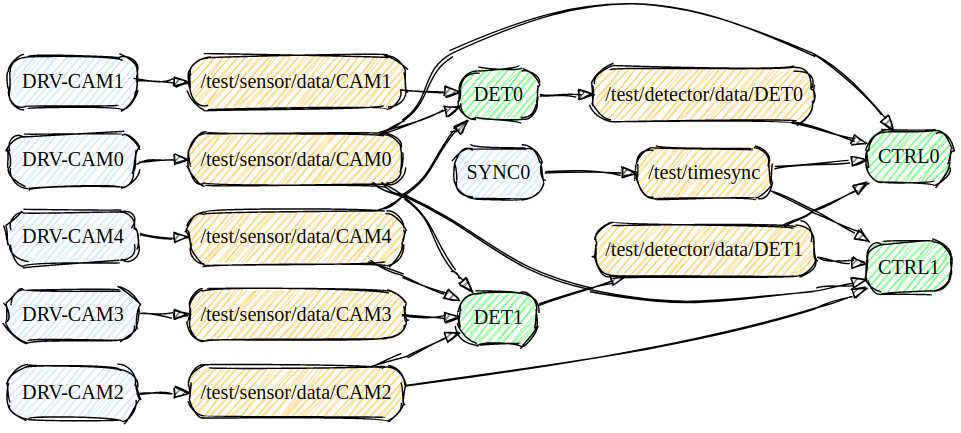

## Overview

Virtual DDS layer on top of real DDS (FastDDS, RTI DDS) with much more efficient intra-process pubsub.



## Key features
Here is short summary of key vDDS features
* Minimal overhead
  * No additional threads
  * No dynamic allocations for plain data types (up to 240 bytes)
  * Lock-free queues per subscriber
* Simple, efficient support for ref-counted data/buffers
  * Easy to share HW-optimized (GPU, DMA, etc) buffers
* Simple clean API
  * Simple data types
  * Type safe wrappers for pub/sub operations
  * Simple pub/sub registration during object construction
* Configurable queue depth per-subscriber
  * This helps with minimizing memory footprint (most topics and subscribers need very shallow queues)
  * And allows for allocating large queues as needed in case the subscriber is a low-priority background thread
* Flexible wait/notify mechanism
  * Polling or CV based notification
  * Shared notifiers (multiple sub-queues can share condition-variable)
* High perf logging of all key operations
  * Detailed trace of when data published, etc
  * Logs are mixed (hogl) with the user app logs (easy to trace all events)
  * Trace format is compatible with hogl-trace tool that generates Chrome Trace Files

## Build dependencies

vDDS requires the following components to build
* CMake (3.15 or later)
* Compiler with C++14 support
* HOGL logging library (3.0 or later)
* Boost libary (1.59.0 or later) 

CMakeList includes necessary checks for all requirements.

## Build procedure

Install dependencies and run
```
mkdir build && cd build
cmake -DCMAKE_CXX_FLAGS="-O3 -Wall -g -std=c++14" ..
cmake -j
ctest -j
```

